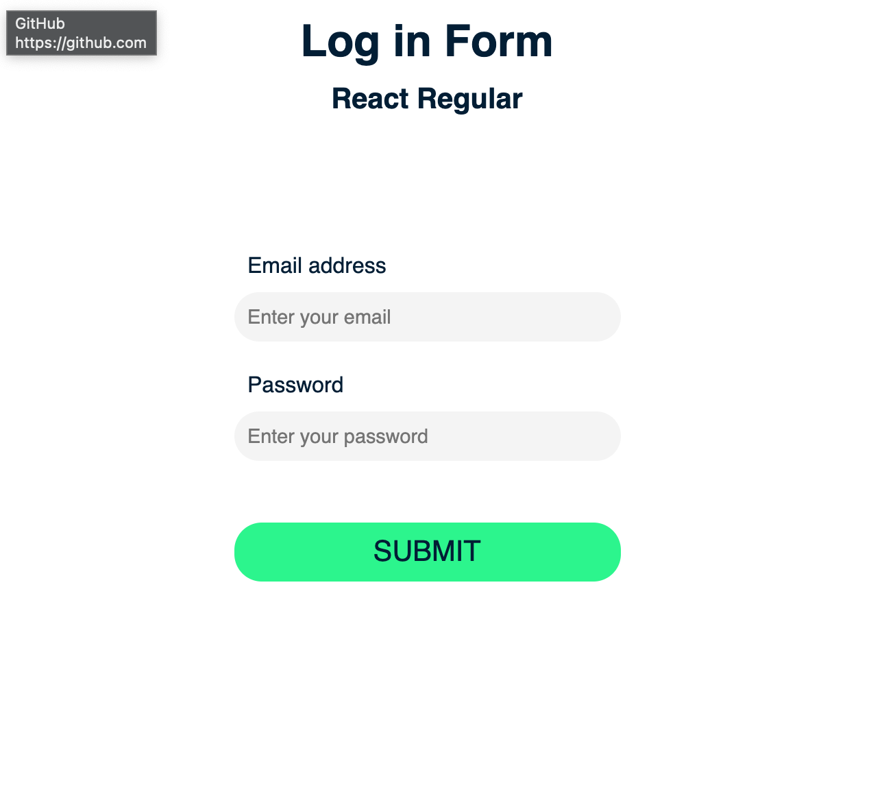

<<<<<<< HEAD
#  :white_check_mark: My regular React form 

## Create a log in form without libraries to manage validation 
=======
#  :v: My Formik form 

## Create a log in form with Formik
>>>>>>> 9d3a75ca6d7f59eca4bd31c51177c26f4efb6c36

## Illustration


## Language/tools
- HTML5 / CSS3 / SCSS
- Javascript / REACT / Hooks
<<<<<<< HEAD

## Goals 
- Work on validation form
=======
- Formik

## Goals 
- Work on validation form
- Discover Formik
>>>>>>> 9d3a75ca6d7f59eca4bd31c51177c26f4efb6c36
- Components architecture for scalable application
- UX / UI

## How to use 

### Install project dependencies
``` javascript
yarn
```

### Launch the development server & meeting on http://localhost:8080/
``` javascript
yarn start
```

### Production build
``` javascript
yarn build
```

## Status
Project completed

## Context
Project developed as a web developer post diploma
