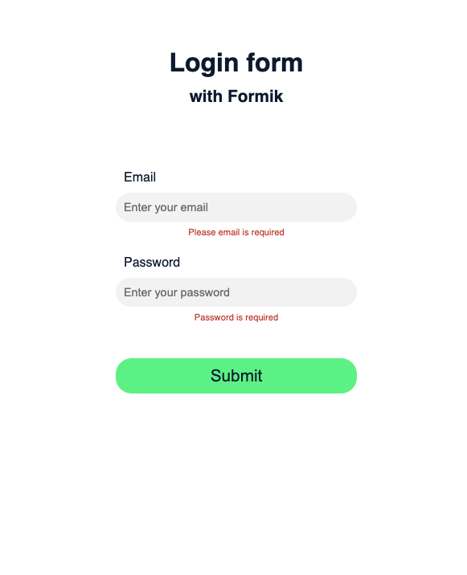

#  :white_check_mark: My regular React form 

## Create a form without libraries to manage validation 

## Illustration


## Language/tools
- HTML5 / CSS3 / SCSS
- Javascript / REACT / Hooks

## Goals 
- Work on validation form
- Components architecture for scalable application
- UX / UI

## How to use 

### Install project dependencies
``` javascript
yarn
```

### Launch the development server & meeting on http://localhost:8080/
``` javascript
yarn start
```

### Production build
``` javascript
yarn build
```

## Status
Project not completed

## Context
Project developed as a web developer post diploma
